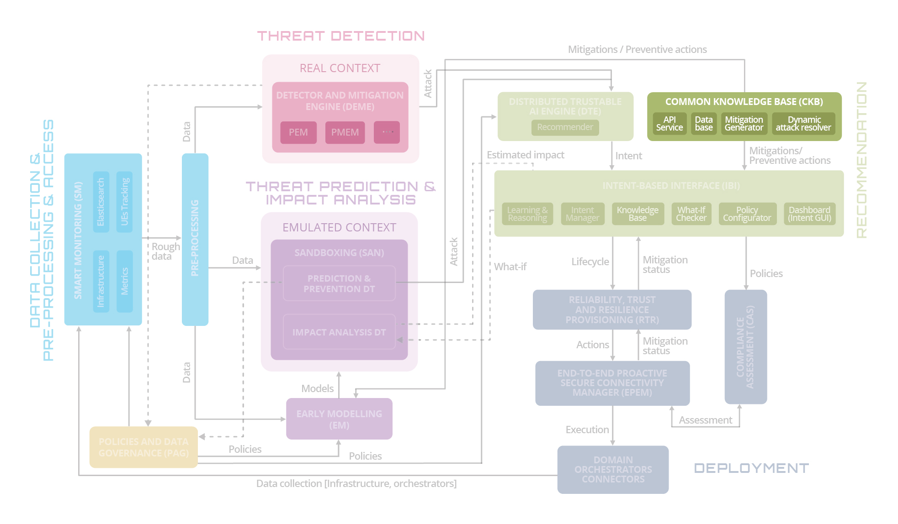
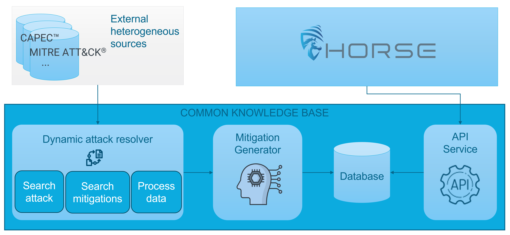
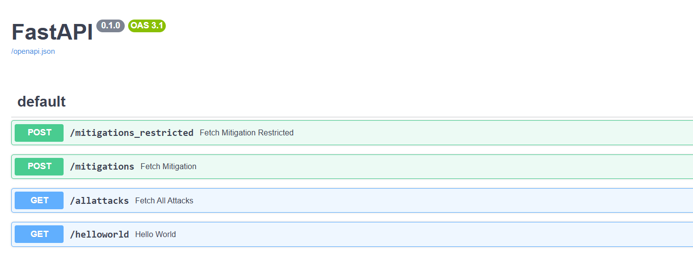
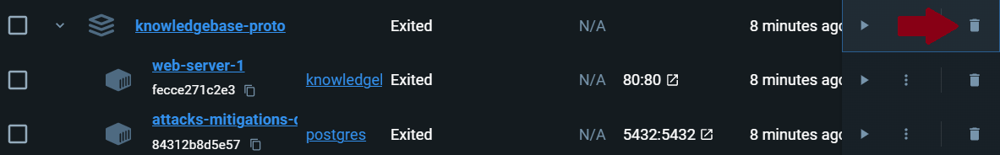
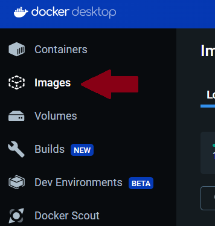
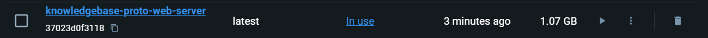
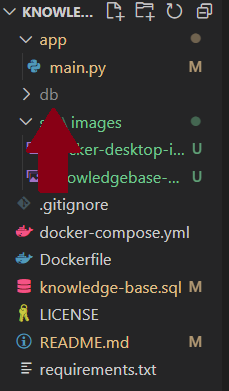

# Common Knowledge Base

## 📚 Table of Contents

- [📖 About the Common Knowledge Base](#-about-the-common-knowledge-base)
- [🛠️ API Usage](#️-api-usage)
  - [Interactive API Docs](#interactive-api-docs)
  - [Quick Examples Request](#quick-examples-request)
  - [Response Example](#response-example)
- [⚙️ Setup Requirements](#️-setup-requirements)
- [📄 Deployment Instructions](#-deployment-instructions)
- [⬆️ Latest Updates](#️-latest-updates)
- [📜 License](#-license)
- [📌Acknowledgement](#acknowledgement)


### 📖 ABOUT THE COMMON KNOWLEDGE BASE
Welcome to the HORSE project's Common Knowledge Base development repository.



The **Common Knowledge Base (CKB)** is an enhanced, AI-powered database designed to centralize and enrich information on cyberattacks and corresponding mitigations.

CKB integrates data from heterogeneous sources—such as CAPEC, MITRE ATT&CK, and custom threat intelligence—and uses generative AI techniques to:
- Merge overlapping or fragmented information across datasets
- Generate human-readable descriptions of attacks and mitigations
- Rank relevant mitigations based on their effectiveness and context

To learn more about the generative AI process used to enhance the content of the CKB, visit the [HORSE-GenAI-CKB repository](https://github.com/martel-innovate/HORSE-GenAI-CKB).



### 🛠️ API USAGE

The Common Knowledge Base (CKB) offers RESTful APIs to query and interact with its enriched dataset of cyberattacks and mitigations.


**INTERACTIVE API DOCS**

To access the full interactive API documentation, connect to the CKB machine inside a testbed and browse: `http://<host>/docs`. 

For example, using the **UPC testbed**, once connected through the UPC VPN, open a browser and go to: http://10.19.2.18/docs. You now have access to the interactive FastAPI documentation interface, that looks like this:



**QUICK EXAMPLES REQUEST**

To query the CKB service, connect to a machine inside a testbed and open a shell. Use `curl` to performs API calls. For example, using the **UPC testbed**, once connected through the UPC VPN, you can:

Example 1) Retrieve all attacks:
```
curl http://10.19.2.18/allattacks
```

Example 2) Given an attack name, retrieve mitigations:
```
curl -X POST http://10.19.2.18/mitigations -H "Content-Type: application/json"  -d '{"attack_name": "nf_exposure"}'
```


**RESPONSE EXAMPLE**

Responses are returned in **JSON** format and include the following information:

- Attack name
- List of relevant mitigations
- Priority ranking for each mitigation
- Required fields for configuration
- A short description

```json
{
  "attack_name": "nf_exposure",
  "mitigations": [
    {
      "name": "filter_malicious_access",
      "priority": 1,
      "fields": [
        { "name": "actor", "value": "" },
        { "name": "response", "value": "" }
      ],
      "description": "Immediately reacts to interactions flagged as hostile to reduce unauthorized data flow or probing."
    },
    {
      "name": "api_rate_limiting",
      "priority": 2,
      "fields": [
        { "name": "limit", "value": "" }
      ],
      "description": "Limits the frequency of requests, protecting exposed APIs from enumeration or brute-force misuse."
    }
  ]
}

```

### ⚙️ SETUP REQUIREMENTS
- preferred terminal 
- docker desktop
    - installation guide for Linux: https://docs.docker.com/desktop/install/linux-install/
    - installation guide for Windows: https://docs.docker.com/desktop/install/windows-install/
    - installation guide for Mac: https://docs.docker.com/desktop/install/mac-install/
- docker: check if it is installed using ```docker --version``` in your terminal

### 📄 DEPLOYMENT INSTRUCTIONS
1. Download the repo using git clone 
2. Open Docker Desktop app
3. Open terminal and go into KnowledgeBase-proto
4. Install postgres docker image using `docker pull postgres`. When it's done you should see a list of 
```
710e142705f8: Pull complete
cb628c265f09: Pull complete
```
5. Navigate to the src directory using `cd src`
6. Create the `.env` file: Use the `.env.example` template to create a `.env` file in the `src` folder, then copy the `.env` file into the `app` folder as well.
7. Start docker compose using: `docker compose up -d`. The first time it will take a while because it needs to download and install all packages and build the docker image. Once it has finished you should see: 
```
 ✔ Network api-proto_default               Created                       0.1s 
 ✔ Container api-proto-web-server-1        Started                       8.7s 
 ✔ Container attacks-mitigations-database  Started                       8.7s 
```
8. Open a web browser and go to http://localhost/docs to access the API documentation


The web server and the attacks-mitigations database are now running. You can send requests to localhost using the API! 🚀🚀

9. When finished, stop docker compose writing in terminal `docker compose down -v`. Once it has stopped you should see: 
```
 ✔ Container api-proto-web-server-1        Removed                       0.5s 
 ✔ Container attacks-mitigations-database  Removed                       0.7s
 ✔ Network api-proto_default               Removed                       0.3s 
```

## ⬆️ LATEST UPDATES 
If this is not the first time you run the Common Knowledge Base and you want to use the latest updates, please follow the instructions:
1. Open Docker desktop
2. Delete "knowledgebase-proto" from containers



3. Delete "knowledgebase-proto-web-server" from images

 

4. Go into the main folder of this repo, called "KnowledgeBase-proto". If there is a folder called "db", delete it.



5. Now that your environment is clean again, follow "Usage Instructions" starting from point 5: `docker compose up -d`.

Enjoy 😀

## 📜 License

This project is licensed. See the [LICENSE](LICENSE) file for details.

### Data Attribution

This project utilizes attack patterns and mitigation data from the Common Attack Pattern Enumeration and Classification (CAPEC™) database, provided by The MITRE Corporation. 

> **Source:** [CAPEC Website](https://capec.mitre.org/)  
> **License:**  
> *The MITRE Corporation (MITRE) hereby grants you a non-exclusive, royalty-free license to use Common Attack Pattern Enumeration and Classification (CAPEC™) for research, development, and commercial purposes. Any copy you make for such purposes is authorized provided that you reproduce MITRE’s copyright designation and this license in any such copy.*  
>  
> **Disclaimer:**  
> *All documents and the information contained therein are provided "as is," without warranties of any kind. MITRE and its affiliates disclaim any express or implied warranties, including but not limited to warranties of merchantability or fitness for a particular purpose.*  

## 📌Acknowledgement

This repository is part of the [HORSE](https://github.com/HORSE-EU-Project) project. HORSE project has received funding from the Smart Networks and Services Joint Undertaking (SNS JU) under the European Union’s Horizon Europe research and innovation programme under Grant Agreement No 101096342. This work has received funding from the Swiss State Secretariat for Education, Research and Innovation (SERI). Views and opinions expressed are however those of the author(s) only and do not necessarily reflect those of the European Union. Neither the European Union nor the granting authority can be held responsible for them. For more details about the project, visit the [HORSE project website](https://www.horse-6g.eu/) or the [HORSE LinkedIn page](https://www.linkedin.com/company/horse-project-eu/).


 